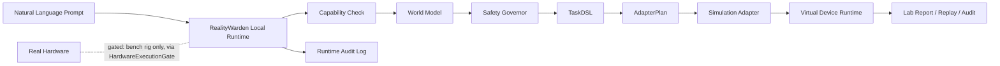

# RealityWarden

## Making Physical AI open, safer, and not locked inside one brand.

**RealityWarden is the audited gate between AI and the physical world — a safety runtime between AI agents and real hardware.**

Many robots, machines, sensors, smart devices, lab instruments, and factory systems already have chips, controllers, motors, sensors, or hardware interfaces.

But they are not automatically AI-controllable.

RealityWarden helps ordinary hardware become part of Physical AI through a **universal software runtime** instead of a closed brand stack.

The goal is to help AI enter the physical world in a way that is:

- more open
- safer
- more stable
- faster to adopt
- easier for more companies and developers to build on
- less dependent on one closed ecosystem

It is built around one rule:

**AI should not send commands straight to hardware.**

Before an AI-generated action can reach a device, RealityWarden routes it through:

- device capability checks
- world-state grounding
- Safety Governor review
- inspectable `TaskDSL` compilation
- `AdapterPlan` validation
- simulation / dry-run boundary
- structured runtime audit logging

Only after every layer passes can an action execute at all — and every run is visibly labeled as simulation or real hardware, never conflated.

The long-term goal is not to build robots or chips.

The goal is to define the **common software execution layer** that lets different brands, devices, adapters, and future hardware stacks expose physical actions through a shared RealityWarden boundary.

If Physical AI becomes locked inside a few closed stacks, fewer companies can participate.

RealityWarden is designed for the opposite direction: more devices, more adapters, more Reality Assets, more integration work, more deployment work, and a wider developer ecosystem around AI-controlled physical systems.

**Current status — v0.5.0 Public Alpha**

- Public Alpha
- the main simulation workbench never touches hardware
- a first, tightly gated REAL hardware path exists for one bench rig
  (ESP32 + SG90 servo + HC-SR04 — see
  [docs/REAL_HARDWARE_ESP32.md](./docs/REAL_HARDWARE_ESP32.md)); it runs only
  through an evidence lock, per-run operator confirmation, and an audited
  safety gate; blocked commands can never reach the wire
- no production hardware control, no industrial safety certification
- local PDF/Markdown/text manual import produces reviewable, simulation-only
  device proposals; a second explicit review is required before a generated
  asset can enter Virtual Lab, and generated assets can never enable a real
  adapter

Real-hardware safety invariants — **43/43 passing**, plus **5/5** virtual-loopback scenarios. The current suite includes fresh per-primitive sensor polling and proves that an interlock change or lost sensor stops a multi-step action with zero further actuation frames. Run `npm run verify` to reproduce the complete automated gate; physical reference-kit checks remain optional field evidence.

**Demo video:** [Robot Arm Golden Path demo](https://github.com/ZqiEE/open-reality-studio/releases/download/v0.1-public-alpha/open-reality-robotarm-demo-release-cut-web.mp4)

## Runtime Architecture



The important point is the boundary in the middle. The current repository proves that AI-to-device workflows can be mediated by a local runtime before anything touches execution.

See [docs/LOCAL_RUNTIME.md](./docs/LOCAL_RUNTIME.md) for the exact runtime scope, audit path, and future Edge Runtime / Reality Chip direction.

## What is implemented now

- **Simulation-first Local Runtime gate**
  - Prompt -> Runtime decision -> `TaskDSL` -> `AdapterPlan` -> dry-run -> simulation
- **Safety Governor**
  - blocks unsafe, unsupported, ambiguous, and not-runnable requests before simulation dispatch
- **Reality Asset foundation**
  - device manifests, capability contracts, world-model assumptions, adapter boundary metadata
- **Structured runtime audit log**
  - execution path is captured in lab reports instead of disappearing inside UI-only state
- **Adapter boundary**
  - simulation adapters exist
  - one reference ESP32 rig exists behind a separate ticketed `HardwareExecutionGate`, evidence lock, sensor interlocks, and per-run operator confirmation
- **Runnable simulation paths**
  - `robot_arm`
  - `smart_light`
  - `camera_sensor`
- **Custom actions across all three runnable paths**
  - strict profile-specific Action Manifests with typed smart-light values
  - built-in reference recipes can be loaded in Action Composer and are
    revalidated before use
  - examples: [`examples/action-manifests`](./examples/action-manifests)

## Develop in simulation, deploy to real hardware

**Develop in simulation, deploy to real hardware — strictly separated, never conflated.** This is invariant 6 of the project: simulated runs are marked `[SIMULATION]`, real runs are marked `real_hardware`, and you always know which world you are acting in.

Simulation is where workflows are built, tested, replayed, and audited before any device is involved. The simulation workbench itself remains a **simulation-only Public Alpha**.
No hardware required.

Simulation and hardware share capability/safety semantics but deliberately use separate execution interfaces; a generic simulation adapter cannot actuate hardware.

## Runnable devices

| Device Type | Main Run | Boundary |
| --- | --- | --- |
| `robot_arm` | Yes | Simulation-only golden path |
| `smart_light` | Yes | Low-risk simulation-only path |
| `camera_sensor` | Yes | Low-risk / read-only simulation-only path |
| `mobile_robot` | No | Coming Soon / not runnable |
| `conveyor_belt` | No | Coming Soon / not runnable |
| `plc_cabinet` | No | Coming Soon / not runnable |
| `lab_instrument` | No | Coming Soon / not runnable |
| `warehouse_rack` | No | Coming Soon / not runnable |
| `sensor_box` | No | Coming Soon / not runnable |

Exact support matrix: [docs/DEVICE_SUPPORT.md](./docs/DEVICE_SUPPORT.md)

## What this Public Alpha does not do

- no real device execution from the main simulation workbench
- no production hardware control
- no certified industrial safety guarantee
- no claim that all device families are runnable
- no silent fallback from unsupported devices into another device path

Do not describe this repository as:

- production-ready
- industrial-grade certified
- real hardware enabled
- full multi-device execution platform

It is a **desktop runtime prototype** with a strict **simulation-only** boundary.

## Why this matters

Most AI product demos still jump directly from language to action.

That is acceptable in software.
It is not acceptable for robotics, labs, factory systems, drones, smart devices, or physical infrastructure.

Physical AI should not depend on one robot brand, one closed stack, or one capital-controlled ecosystem.

A common runtime boundary can let more device makers, developers, integrators, researchers, and service teams participate without each company having to rebuild the whole AI-to-device stack from zero.

RealityWarden exists to prove a different execution model:

1. describe the device as a Reality Asset
2. understand the AI request
3. inspect the target device and its capability contract
4. inspect the world state
5. decide whether the request is allowed, corrected, unsupported, or blocked
6. compile a structured task
7. validate an adapter plan
8. log the decision path
9. only then run simulation

This is the ecosystem direction:

- hardware companies can expose devices through Reality Assets
- developers can build adapters and simulation packs
- integrators can build deployment and monitoring workflows
- safety teams can define rules and review audit trails
- more companies can enter Physical AI without being locked into one closed brand stack

## Quick Start

Clone and install:

```bash
git clone https://github.com/ZqiEE/open-reality-studio.git
cd open-reality-studio
npm install
```

Run web mode:

```bash
npm run dev
```

Open:

```text
http://localhost:3000
```

Run desktop mode:

```bash
npm run desktop:dev
```

Run the production desktop shell from source:

```bash
npm run desktop:prod
```

`desktop:start` is a local convenience script. For repeatable evaluation, use `desktop:dev` or `desktop:prod`.

Build and verify:

```bash
npm run typecheck
npm run build
npm run verify
```

## First-run prompts

Use one of these:

```text
Move the red cube to the back safe zone
```

```text
Throw the red cube off the table
```

```text
Set the light to blue
```

```text
Take a photo
```

Expected behavior:

- safe `robot_arm` request executes in simulation
- unsafe `robot_arm` request is blocked before execution
- `smart_light` and `camera_sensor` run through limited low-risk simulation paths
- Coming Soon devices remain not runnable

## Local Runtime boundary

The current main execution path is:

```text
Prompt
-> Local Runtime
-> Capability Check
-> Safety Governor
-> TaskDSL
-> AdapterPlan
-> Dry Run
-> Simulation Adapter
-> Virtual Device Runtime
-> Lab Report / Replay / Audit
```

This is the current product truth:

- **audited gate before any execution**
- **local runtime gated**
- **adapter boundary present**
- **real execution isolated behind the evidence-locked reference path**

More detail: [docs/LOCAL_RUNTIME.md](./docs/LOCAL_RUNTIME.md)

## Related docs

- [docs/LOCAL_RUNTIME.md](./docs/LOCAL_RUNTIME.md)
- [docs/DEVICE_SUPPORT.md](./docs/DEVICE_SUPPORT.md)
- [docs/OPEN_REALITY_PROTOCOL.md](./docs/OPEN_REALITY_PROTOCOL.md)
- [docs/REALITY_ASSET_DEVELOPER_KIT.md](./docs/REALITY_ASSET_DEVELOPER_KIT.md)
- [docs/REALITY_ASSET_SUBMISSION.md](./docs/REALITY_ASSET_SUBMISSION.md)
- [docs/EVALUATION_GUIDE.md](./docs/EVALUATION_GUIDE.md)
- [docs/WINDOWS_TRIAL_GUIDE.md](./docs/WINDOWS_TRIAL_GUIDE.md)
- [docs/ROADMAP.md](./docs/ROADMAP.md)
- [docs/DEMO_SCRIPT.md](./docs/DEMO_SCRIPT.md)

## Real Device Adapter Boundary

Real-device work stays behind explicit adapter and safety boundaries.

The first real path (ESP32 bench rig) already follows this rule:

- the simulation workbench cannot dispatch to hardware; the SafetyMonitor
  rejects any manifest with a real adapter enabled
- the hardware route runs only through `HardwareExecutionGate`
  (`lib/hardware/`): blocked commands never reach the adapter, offline is
  never faked, missing/stale/implausible sensor data default-blocks actuation,
  and every decision is audited with `hardwareSignalSent`
- simulation and reality stay strictly separated; hardware support expands
  only device-by-device, each behind the same gate
- the default workbench and all manually generated assets remain
  simulation-only; the separately marked reference-rig path is the only real
  hardware scope

## Contributing

- test the runtime boundary
- report unclear execution states
- submit Reality Asset ideas
- propose simulation-ready device manifests

The repository is most useful when contributions preserve the current rule:

**AI should not touch reality directly.**
